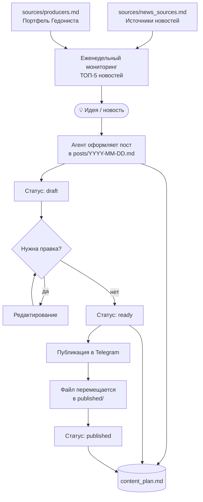

# Content Factory

Автоматизированное ведение Telegram-канала Игоря Шореца — сомелье и wine director.

## Пайплайн



## Структура

```
Content-factory/
├── agents.md           # правила агента
├── content_plan.md     # контент-план со статусами
├── posts/              # черновики и готовые посты
├── published/          # архив опубликованных постов
└── sources/
    ├── producers.md    # портфель производителей Гедониста
    └── news_sources.md # источники для еженедельного мониторинга
```

## Статусы поста

| Статус | Описание |
|---|---|
| `draft` | Сырая идея, требует доработки |
| `ready` | Готов к публикации |
| `published` | Опубликован, перемещён в архив |
