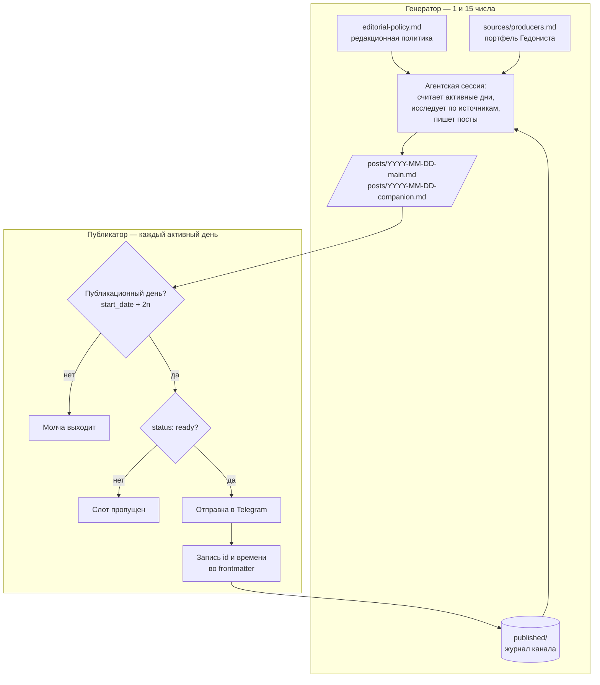

# Content Factory

Автоматизированное ведение Telegram-канала о вине. Материалы готовит и публикует бот.

## Архитектура

Система разделена на два независимых контура. Они не знают друг о друге,
связь только через файлы в `posts/`.


```mermaid
flowchart TD
    subgraph GEN["Генератор — 1 и 15 числа"]
        P[editorial-policy.md<br/>редакционная политика] --> R
        PR[sources/producers.md<br/>портфель Гедониста] --> R
        J[(published/<br/>журнал канала)] --> R
        R[Агентская сессия:<br/>считает активные дни,<br/>исследует по источникам,<br/>пишет посты] --> Q
    end

    Q[/posts/YYYY-MM-DD-main.md<br/>posts/YYYY-MM-DD-companion.md/]

    subgraph PUB["Публикатор — каждый активный день"]
        Q --> C{Публикационный день?<br/>start_date + 2n}
        C -- нет --> SKIP1[Молча выходит]
        C -- да --> S{status: ready?}
        S -- нет --> SKIP2[Слот пропущен]
        S -- да --> T[Отправка в Telegram]
        T --> M[Запись id и времени<br/>во frontmatter]
        M --> J
    end
```

Генератор ничего не публикует. Публикатор ничего не пишет.
Материал без проверенных источников получает `status: needs_sources`
и в канал не уходит: пропущенный слот лучше выдуманного факта.

## Ритм

Публикационные дни идут через день: `start_date + 2 × n`. Смена месяца
отсчёт не обнуляет, привязки к дням недели нет.

| Время МСК | Слот | Обязателен |
|---|---|---|
| 12:00 | `main` | да |
| 19:00 | `companion` | нет, только при самостоятельной ценности |

## Структура

```
content-factory/
├── editorial-policy.md     # редакционная политика — источник истины по содержанию
├── channel.yml             # ритм, дата отсчёта, слоты
├── agents.md               # правила агента
├── bot/
│   ├── publish.py          # публикатор по расписанию
│   └── generator-brief.md  # механика пакетного прогона
├── posts/                  # подготовленные материалы, ждут своего слота
├── published/              # журнал канала: что вышло, с источниками
├── sources/                # производители и источники новостей
└── archive/                # отменённая механика
```

## Ручной запуск

Workflow «Публикация в Telegram» принимает `slot` (`main` / `companion`)
и `date` — для выпуска пропущенного поста задним числом.

## Секреты

`BOT_TOKEN` и `CHANNEL_ID` — в секретах репозитория GitHub.
